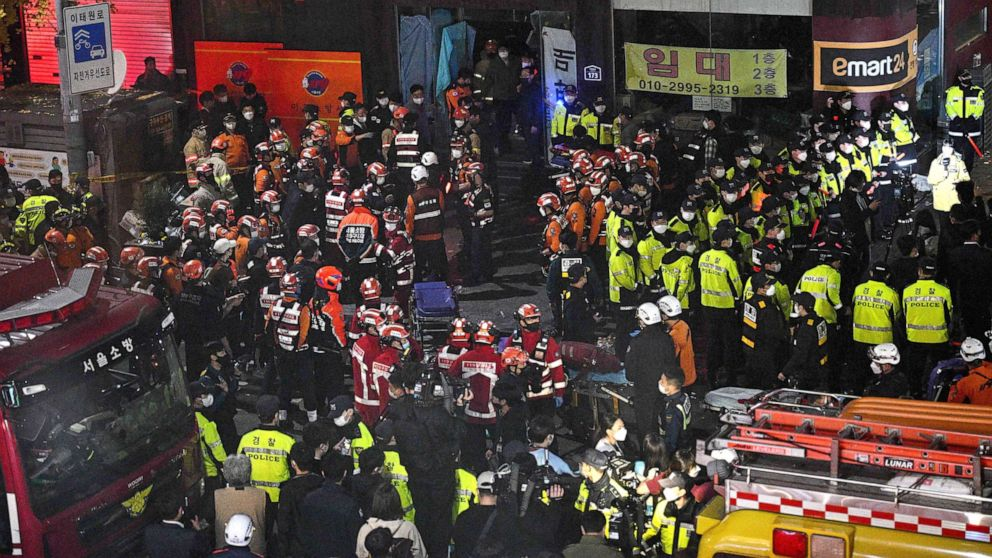
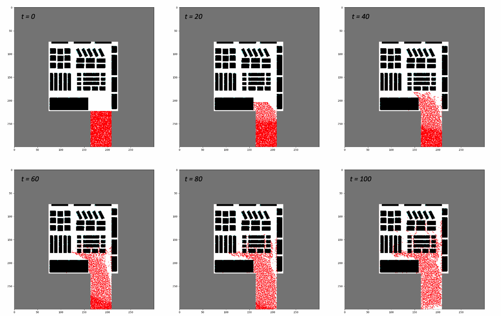

# simuLayout: Multi-agent Simulation Software for Crowd Crush Prevention

## Introduction
Last October, a devastating tragedy struck my hometown South Korea, where a fatal crowd crush incident claimed the lives of 159 young adults, out in the streets of Itaewon to celebrate Halloween. I was miles away at Stanford when the news reached me, but I couldn't shake off a sort of profound disquiet within myself. Well, they were mostly around my age, and had my friends and I been in Korea, we could have been one of them. The lingering feeling that I could've also lost a loved one, and the fact that someone's son or daughter had senselessly passed away, pushed me to delve deeper into the phenomena of crowd collapses.
<p align="center">
  
  <br>News Coverage of the Itaewon Tragedy.
</p>
While diving into the topic, I came across a shockingly long list of such tragedies, from the 1990 Mecca tragedy in Saudi Arabia with 2,300 lost lives to the 1989 Hillsborough disaster that took 97. Shockingly, even events as familiar to us as Black Friday sales see similar incidents in large retail stores. 

Back in 2019, my friends and I had drafted a crowd collapse simulation paper using multi-agent simulations ([available HERE]()) as part of a mathematical modelling competition. With the fresh pain of the recent Halloween incident, I was compelled to revisit our work and develop a more robust software to predict crowd movements in navigation environments (scenarios where agents have obstacles and destinations). 

## Model 
The simulation seeks to predict the movement of agents within a store, based on data given about the store. 

## User Input and Example Output
The software will return a gif simulation in a specified directory, with a randomly generated SLURM-job-id-esque `unique_id` to avoid confusion. The inputs are as follows: 
- `-l` flag: The rankings of each athlete and their overall performance indicators. 
- `-l` flag: The rankings of each athlete and their overall performance indicators. 
- `-d` flag: The rankings of each athlete and their overall performance indicators. 
- (Optional) `-l` flag: The rankings of each athlete and their overall performance indicators. 
The simulation is dependent on the layout 
from bird eye view. 
DXF files and PNG files for 

It then produces a gif simulation in your directory. An example screenshot of the simulation is provided below: 
<p align="center">
  
  <br>Screenshots of Example Simulation (t = 120)
</p>
examplesimulation.png
## Usage
This software is implemented in both C++ (faster, experimental) and Python. Either way, to use the software, 
1. Clone the repository onto your local machine: 
```
git clone git@github.com:seanyoon777/simuLayout.git simuLayout
```
You can replace the simuLayout with any directory path of your choice. 

2. Now, set up the Conda environment. Most of the requirements are widely used packages, such as scipy or pandas, except `fpdf`. So run either 
```
conda install -c conda-forge fpdf
```
or 
```
conda env create -f environment.yml
```
and run 
```
conda activate papers
```

3. Navigate into the current directory. 

4. The input data should be a csv file with seven columns: `Year`, `Player1`, `Country1`, `Player2`, `Country2`, `Score1`, `Score2`. `Year` is the year the match had taken place, and `Player1` and `Player2` is the player name or equivalent uniquely identifiable name. `Score1` and `Score2` are scores for each player in the given match. `Country1` and `Country2` should be the country codes for players, although it is only for player identification purposes. 

5. To use the model, run the below command on your terminal: 
### Experimental Version: 


### Python Version: 

